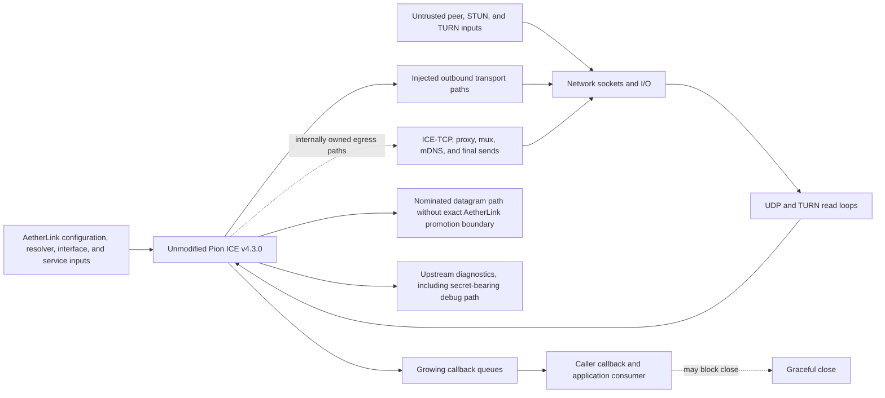
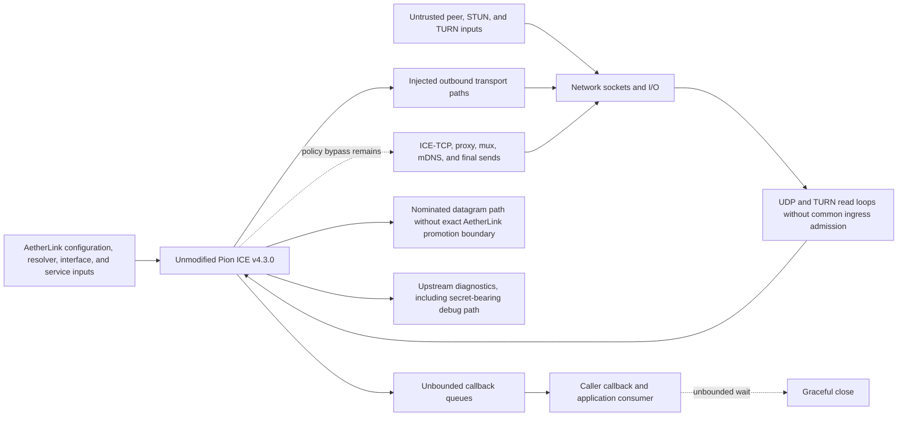
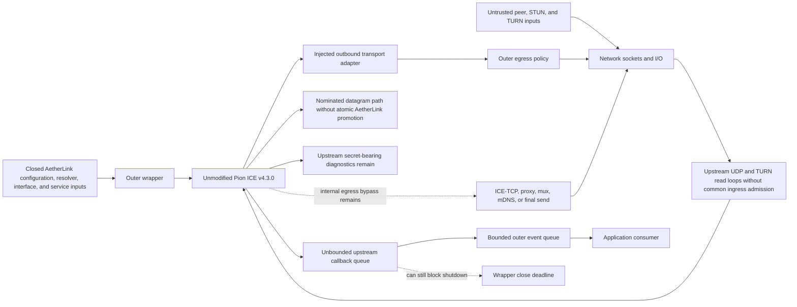
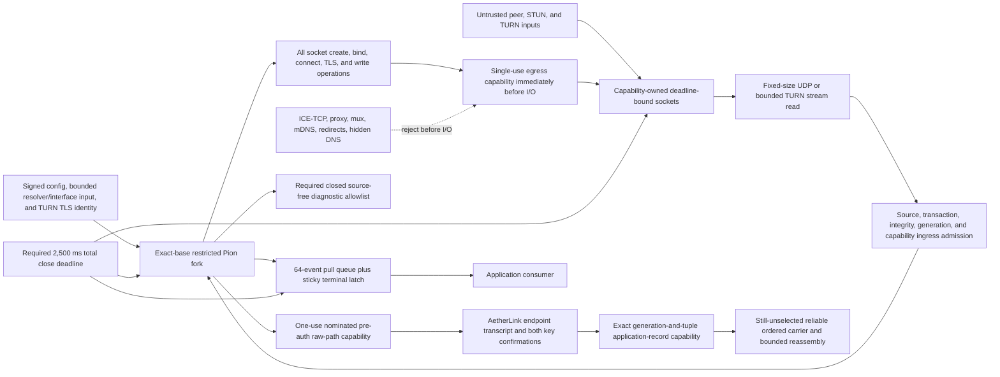

# Security Hardening Proposal: Make Pion Policy And Lifetime Ownership Structural

## Decision

We need to decide which, if any, of three reviewed Pion ICE v4.3.0 shapes is
worth carrying into a separate G2 official-source identity and acquisition
decision: unmodified upstream, an outer wrapper, or an exact-base restricted
fork. This proposal may identify a candidate shape for the next technical rung;
it cannot select Pion, acquire source, or claim that a proposed control exists.

Portfolio status is `implementationStatus=not_implemented`; runtime verification
is `not_executed`. No external identity proof, repository-owner authentication,
or additional user action is required for this personal-project design review.

## Executive Recommendation

The complete option set is:

- Option 1: **Unmodified upstream** preserves Pion ICE v4.3.0 and treats its
  configuration model as the control boundary.
- Option 2: **Wrapper-only gateway** places closed configuration, egress policy,
  and callback adapters around unmodified upstream.
- Option 3: **Policy-owned restricted fork** would patch the exact base so every
  egress side effect, ingress mutation, path promotion, event, diagnostic,
  resource, and close transition obeys one closed AetherLink profile.

Among these three reviewed Pion v4.3.0 shapes, I recommend Option 3 only as the
input to a separate rung-two provenance and acquisition decision. Option 1
retains the observed blockers. Option 2 narrows ordinary caller behavior but
cannot own upstream-internal sockets, read loops, queues, diagnostics, or close
waits. Option 3 could make the required invariants falsifiable at structural
boundaries, but none of its changes is implemented or runtime-verified.

The conclusion is intentionally qualified. A new exact library or later Pion
release may begin its own rung-one review. This proposal does not say a
restricted fork is the only possible P2P implementation, and it does not
authorize source acquisition, compilation, loading, sockets, or network use.

## Evidence

The ordered registry is [context.md](../context.md) and
[`evidence-manifest-v1.json`](../evidence-manifest-v1.json). These four IDs are
defined locally so the proposal remains reader-facing and auditable:

| Evidence | Finding or document | What it establishes |
| --- | --- | --- |
| `G2E001` | [G2 new-stack requirements and Pion v4.3.0 as-is rejection](../../g2-requirements-review-v1.md) | Pins Pion ICE v4.3.0 commit `1e8716372f2bb52e45bf2a7172e4fb1004251c46`; records the missing common outbound boundary, secret-bearing diagnostic, unbounded callback queue, and shutdown wait. |
| `G2E002` | [AetherLink V1 G0 decision](../../../../v1/g0/decision-v1.md) | Establishes the V1 platform matrix, two-plane route design, transport-neutral endpoint-identity floor, route authorization, and privacy constraints. |
| `G2E003` | [Canonical V1 roadmap](../../../../roadmap.md) | Establishes active personal-project governance, the sequential G2 technical ladder, bounded candidate requirements, and the current no-selection boundary. |
| `G2E004` | [Canonical session handoff](../../../../handoff.md) | Establishes current personal-project truth and confirms that no Pion source was retained, compiled, loaded, or executed and no socket or network rung was opened. |

The manifest hash is
`98e0e53955e21a833fe19852ce00f64df2dc808506bdb222c9b8a20bc8006d00`;
the ordered collection hash is
`9e395c4c4f7f61a4810d47cf96ff57b47c1908c73ea459181f1c06f26a35d704`.
These values bind the four evidence bytes as one finalized inventory.

`G2E001` is official-source pre-acquisition evidence, not a retained source
tree. `G2E002` contains a historical authority boundary, while `G2E003` and
`G2E004` establish the current personal-project governance: repository-owner
identity proof and role receipts are not active prerequisites. Product endpoint
authentication remains mandatory and separate from project-owner identity.

## Current Design And Failure Mode

The reviewed upstream shape has useful network and candidate filters. Those
controls do not own the final edge of every side effect. Active ICE-TCP,
proxy/mux, STUN, TURN, mDNS, and final-send behavior do not all cross one common
post-resolution immediate pre-I/O decision. A wrapper around the injected
transport therefore cannot prove that every socket create, bind, connect, TLS
handshake, credential write, or datagram write consumed a fresh decision for
the exact numeric tuple and purpose.

The reverse direction is a separate problem. A remote source is unknowable
until data is read, so ingress cannot reuse an egress decision. UDP and TURN
stream paths need fixed-size reads and bounded minimal parsing, then exact
source, transaction, integrity/fingerprint, allocation/permission/channel,
generation, nominated-tuple, and content-capability checks before any state
mutation, event, forwarding, peer-reflexive insertion, or payload delivery.
That inventory must include inbound ICE Binding requests, consent, TURN Data
Indication and ChannelData, and selected-pair direct or relay payloads.

TURN over TLS also needs an explicit service-identity contract. A generic TLS
dial is insufficient: signed service configuration must bind the G1 trust
source, exact SNI and DNS-ID, trust-anchor digest, optional SPKI pins, TLS 1.3,
`stun.turn` ALPN, expiry, and a 5,000 ms handshake deadline before any TURN
credential is transmitted. Ambient proxies, `InsecureSkipVerify`, and an
unbound ambient trust store must fail closed.

Nomination creates reachability, not application readiness. The existing
AetherLink secure-session handshake needs a narrow transport before endpoint
confirmation. The future boundary therefore must issue one bounded one-use
pre-auth raw-path capability for confirmation and carrier negotiation only,
then atomically consume it after the exact transcript, both key confirmations,
path receipt, generation, tuple, and endpoint roles match. Pion, ICE state, and
TURN service authentication must never perform that endpoint promotion.

There is also a carrier mismatch. Pion provides unordered, unreliable
datagrams; `RuntimeRawFrameBodyChannel` requires an ordered reliable channel,
and a canonical secure record may be 1,048,576 bytes. A reliable carrier and
bounded fragmentation/reassembly format are not selected. Runtime attachment
must remain blocked until both are separately decided and verified.

Finally, the ownership split recurs in resources and lifetime. An outer queue
can be bounded while an inner queue grows. An outer timeout can return while
internally owned sockets or workers remain live. A queue cannot safely reserve
its own overflow event once full, so the future design needs an independent
sticky terminal latch that discards nonterminal events and closes without
consumer progress. Packet, STUN/TURN, attribute, rate, transaction, retransmit,
task, goroutine, socket, TURN allocation/permission/channel, generation,
reassembly, event, and two-session process totals all need exact ceilings.

The current structure is shown at one stable abstraction level in the
[before architecture](../diagrams/pion-ice-policy-owned-restriction-before.mmd):

## Desired Invariants

- Every egress attempt consumes a single-use capability after resolution and
  immediately before socket create, per-interface bind, read-loop arm, connect,
  TURN TLS handshake, credential write, STUN/TURN write, consent, pre-auth
  handshake, or authenticated record-fragment write.
- Egress capabilities bind session digest, generation, purpose, transport,
  address family, interface, scope, signed service and candidate digests,
  resolution provenance, and exact local/remote tuple. Re-resolution, redirect,
  tuple, purpose, transport, generation, or credential-class change invalidates
  them.
- Every UDP or TURN stream read uses a fixed maximum and bounded parse. Before
  mutation or delivery, ingress validates current socket capability, exact
  source/interface, message class/length, expected transaction, required
  integrity/fingerprint, TURN state, generation/tuple, and content capability.
- Invalid ingress is dropped before state mutation and changes only a saturating
  source-free reason counter.
- TURN TLS binds signed service ID, exact ASCII name and port, transport,
  trust-anchor digest, optional SPKI SHA-256 pins, credential scope, expiry, and
  configuration digest. No credential is sent before all TLS identity checks.
- Nomination yields one pre-auth capability, valid for at most 15 seconds,
  64 datagrams, and 65,536 bytes of AetherLink confirmation and carrier
  negotiation only. It is not peer authentication or an application channel.
- Exact transcript confirmation and both key-confirmation digests atomically
  consume pre-auth and issue an application-record capability bound to the same
  generation, tuple, path receipt, role set, and secure-session digest.
- Consent loss, path change, restart, expiry, failure, or close revokes pre-auth
  and application capabilities.
- Runtime attachment is impossible until a reliable ordered carrier and
  bounded fragmentation/reassembly format for up to 1,048,576-byte canonical
  secure records are selected and verified.
- Limits cover current, draining, and closing generations. The process supports
  at most two sessions, and aggregate ceilings are the exact sum across both.
- At minimum, the profile bounds 16 interfaces, 32 candidates per endpoint,
  1,024 pairs, four STUN and four TURN servers, two TURN allocations,
  32 permissions and 32 channels per session, 4,096-byte STUN/TURN control
  messages, 64 attributes, packet/byte rates, 128 outstanding transactions,
  seven retransmits, 64 tasks, 96 goroutines, 24 sockets, two overlapping
  generations, and bounded reassembly.
- The normal event queue holds at most 64 events and 256 KiB. Overflow
  atomically sets one independent sticky terminal latch, discards nonterminal
  events, and closes without waiting for a consumer.
- Close rejects new work, closes owned sockets, revokes every capability,
  cancels timers, sets the terminal latch, drains only internal bounded workers,
  and returns success or terminal timeout within 2,500 ms.
- Diagnostics contain only closed state/reason codes and saturating counts;
  credentials, candidates, addresses, hostnames, certificate subjects, stable
  identities, payloads, backend credentials, and traffic keys are absent.
- The bridge makes only full ICE, regular nomination, one component, UDP4/UDP6,
  server-/peer-reflexive and relay candidates, ordered trickle, policy-gated
  STUN/TURN, and consent available. ICE-TCP, proxy, mux, mDNS, redirect,
  implicit DNS, automatic port mapping, telemetry, and hidden bootstrap fail
  before I/O.

## Constraints And Non-Goals

The product still needs full ICE at both endpoints, regular nomination,
UDP4/UDP6 checks, server-reflexive, peer-reflexive, and relay candidates,
generation-scoped trickle, consent freshness, and TURN through both egress and
ingress policy. Host candidates remain disabled by default and require a future
explicit same-link capability.

The bridge cannot make Pion a peer-identity authority. Product endpoint
authentication, transcript confirmation, record encryption, route binding,
revocation, and pair epochs remain AetherLink responsibilities. Repository-owner
identity authentication is unrelated and is not required for this personal
project.

This proposal does not define a new signaling schema, acquire source, create a
fork, install Go or gomobile, compile an AAR or XCFramework, load code, create a
socket, run a network or physical device, measure NAT behavior, deploy a
service, or perform Git operations. No option is implemented. No source or
runtime claim follows from the diagrams or requirements.

## Before Architecture

The before view has split authority for egress, no common admission before
ingress state changes, no exact endpoint-promotion boundary, upstream diagnostic
and queue ownership, and close coupled to consumer behavior. Its node and edge
classes are intentionally reused in each option's after diagram so the
comparisons stay at the same abstraction level.

## Options

### Option 1: Retain Unmodified Pion ICE v4.3.0

This option has the smallest patch and rebase burden. It also leaves the exact
reviewed source shape unchanged. The internally owned egress bypass, upstream
read loops, missing TURN TLS identity timing, missing path promotion, secret
diagnostic, growing queues, and callback-coupled close remain. Disabling a
feature by caller convention does not make its internal path impossible.

Evidence coverage: `G2E001`, `G2E002`, and `G2E003` are unaffected and still
require tactical closure; `G2E004` is unaffected because the option performs no
acquisition or runtime action.

The [Option 1 after diagram](../diagrams/pion-ice-policy-owned-restriction-upstream-as-is-after.mmd)
uses the same architecture vocabulary as the baseline:

| Change | Before | After | Security consequence | Cost |
| --- | --- | --- | --- | --- |
| Egress ownership | Injected paths coexist with internally owned bypasses | Unmodified upstream retains the same split ownership | No egress bypass closes | No patch cost, but the option remains inadmissible |
| Ingress admission | UDP and TURN read loops lack one common pre-mutation gate | The same upstream read loops remain | Invalid ingress can still reach internal state before an AetherLink-owned admission point | No migration cost, but no security closure |
| TURN identity and endpoint promotion | No exact TURN TLS credential boundary or AetherLink path-promotion owner | No structural owner is added | Service authentication and endpoint promotion remain unproven | No implementation work because the option remains rejected |
| Resources and shutdown | Inner queues can grow and close can wait on consumer code | Queue and close ownership remain unchanged | Finite resource and shutdown guarantees remain unavailable | Lowest maintenance burden with unacceptable residual risk |

| Dimension | Direction | Assessment | Validation |
| --- | --- | --- | --- |
| Security | Neutral | All structural blockers remain | Repeat exact offline source review; any unchanged blocker keeps rejection |
| Performance | Neutral, unknown confidence | No added boundary, but nothing was built or measured | Do not benchmark before security admissibility |
| Memory | Unknown | Inner resources and queues lack closed aggregate ceilings | Require finite per-session and process maxima before testing |
| Reliability | Regresses | Blocked consumer code can prevent deterministic close | Permanently block the consumer and assert the 2,500 ms bound |
| Operability | Mixed | Lowest patch burden, but diagnostics violate the secrecy boundary | Inject sentinel secrets and scan every log level |
| Migration | Improves in effort only | Minimal integration does not make an inadmissible option safe | Do not migrate while rejected |

Rollback is trivial because no dependency has been added: retain no Pion
candidate and keep the authenticated sealed-relay design.

### Option 2: Add A Wrapper-Only Gateway

A wrapper could accept only signed configuration, inject bounded resolver and
interface input, narrow network types, wrap the ordinary outbound adapter,
redact wrapper-owned diagnostics, publish a bounded outer event queue, and
enforce caller deadlines. Those are useful defense-in-depth controls.

They are not structural closure. A wrapper cannot intercept an internal socket
path that never calls its adapter or an upstream read loop before it mutates ICE
or TURN state. It cannot ensure that TURN credentials wait for the exact signed
TLS identity, or atomically promote the actual nominated internal path after
AetherLink confirmation. A bounded outer queue cannot bound the inner queue,
and returning from an outer close deadline does not establish revocation.

Evidence coverage: this option mitigates `G2E001`, `G2E002`, and `G2E003` on
ordinary wrapper-controlled paths but leaves tactical inner-source work; it
leaves `G2E004` unchanged.

The [Option 2 after diagram](../diagrams/pion-ice-policy-owned-restriction-wrapper-only-gateway-after.mmd)
keeps the remaining bypass and inner queue visible:

| Change | Before | After | Security consequence | Cost |
| --- | --- | --- | --- | --- |
| Configuration and egress | Caller configuration and injected outbound paths do not cover internal bypasses | A closed wrapper and outer egress gate cover only wrapper-controlled paths | Normal-path misuse narrows, but internal create, bind, connect, and send paths remain outside the gate | Moderate wrapper and policy maintenance |
| Ingress admission | Upstream read loops mutate state before a common AetherLink admission point | The wrapper still receives data after upstream processing | The wrapper cannot prove pre-mutation admission | Outer validation work without inner-path closure |
| TURN identity and promotion | TURN credential timing and nominated-path promotion have no exact owner | Wrapper checks cannot atomically own upstream TLS or nominated internal state | Identity and promotion bypasses remain | Additional coordination across two owners |
| Events and shutdown | Inner callback queues and close waits are unbounded | A bounded outer queue and caller deadline sit outside the inner queue | Consumer isolation improves only after the upstream queue | Two queue/lifetime layers complicate failure handling |

| Dimension | Direction | Assessment | Validation |
| --- | --- | --- | --- |
| Security | Improves partially | Normal configuration narrows; internal egress, ingress, TLS, and promotion bypasses remain | Trace every create, bind, connect, read, write, callback, and close path |
| Performance | Neutral, unknown confidence | Outer checks add bounded work; no measurements exist | Measure only after full path ownership is shown |
| Memory | Unknown | Bounded outer state cannot bound inner queues, workers, sockets, TURN state, or reassembly | Flood all inner producers with the outer consumer blocked |
| Reliability | Neutral | Caller can stop waiting, but internal resource revocation is unproven | Inspect workers, sockets, and capabilities after timeout |
| Operability | Regresses | Two control owners complicate incident attribution | Verify each source-free reason code identifies the actual owner |
| Migration | Improves | Lower patch drift, but acceptance remains impossible | Reconsider only after a new exact upstream closes every inner gap |

Rollback removes the wrapper and retains no P2P candidate.

### Option 3: Maintain A Minimal Policy-Owned Restricted Fork

Option 3 would change ownership inside the exact base rather than adding another
layer. The required patch areas are: separate egress capability and ingress
admission; closed diagnostics; bounded pull events plus an independent sticky
terminal latch; deadline shutdown; removal or fail-closed rejection of
non-profile paths; bounded resolver/interface input and TURN TLS identity; and
one-use pre-auth-to-application path promotion.

Every egress create, bind, connect, TLS, credential, protocol, and record write
would consume an exact capability immediately before I/O. Every inbound STUN,
ICE, consent, TURN response, TURN Data Indication, ChannelData, peer-reflexive,
pre-auth, and record-fragment path would be bounded and admitted before state
mutation or delivery. This is two directional controls, not one ambiguous
“network gateway.”

TURN TLS would consume only signed service identity from the G1 trust source
and would send no credential until exact TLS 1.3, SNI, DNS-ID, trust digest,
optional SPKI pin, `stun.turn` ALPN, expiry, and deadline checks pass. Nomination
would create a one-use pre-auth capability, not an application channel. Exact
AetherLink transcript and both key confirmations would atomically promote the
same path. Consent loss, path change, restart, expiry, failure, and close would
revoke it.

The resource design would cover both sessions and current, draining, and
closing generations. It would reject lengths, counts, rates, and aggregate
totals before allocation or state insertion. Event overflow would set the
independent terminal latch and close without waiting for a consumer. This
requirement is not an implementation result.

The fork still cannot attach its datagram path to
`RuntimeRawFrameBodyChannel`. Reliable ordering and bounded fragmentation and
reassembly for 1,048,576-byte canonical records remain an explicit blocker.
The cost includes fork rebases, advisory response, exact toolchains, dependency
closure, SBOM, reproducibility, carrier selection, and incident ownership.

Evidence coverage: the proposed shape addresses the design gaps in `G2E001`,
the identity/route boundary in `G2E002`, and the candidate requirements in
`G2E003`, but only after future implementation and validation. It intentionally
leaves the current no-source/no-runtime state in `G2E004` unchanged.

The [Option 3 after diagram](../diagrams/pion-ice-policy-owned-restriction-restricted-fork-policy-owned-after.mmd)
uses the same input, I/O, session, diagnostic, event, consumer, and close
abstractions as the other views:

| Change | Before | After | Security consequence | Cost |
| --- | --- | --- | --- | --- |
| Egress ownership | Final side effects can bypass caller-owned policy | Every create, bind, connect, TLS, credential, protocol, and record write requires one exact capability immediately before I/O | Destination and purpose authority becomes a structural review point | Per-I/O policy work and fork patch ownership |
| Ingress admission | Reads can reach state before one common admission boundary | Fixed-size reads and bounded parsing precede exact source, transaction, integrity, generation, TURN-state, and content-capability checks | Invalid input is required to fail before mutation or delivery | Complete read-loop inventory and ongoing path audits |
| TURN identity and endpoint promotion | TURN TLS and nomination do not authenticate an AetherLink endpoint | Signed TURN service identity precedes credentials, then exact transcript and both key confirmations atomically promote the path | Service identity and endpoint identity remain separate and fail closed | G1 trust binding plus direct/relay conformance work |
| Capability lifetime | Consent loss, path change, restart, expiry, failure, or close lacks one structural revocation owner | Each event atomically revokes pre-auth and application capabilities before further I/O or delivery | Stale paths cannot retain application authority by design | Atomic state-machine implementation and mutation coverage |
| Resources and events | Inner resource totals and callback queues lack closed aggregate bounds | Exact session/process ceilings, a bounded pull queue, and an independent sticky terminal latch are required | Exhaustion fails before allocation and terminal state does not depend on consumer progress | Limit accounting across active, draining, and closing generations |
| Shutdown and carrier | Close can depend on consumers, and the datagram path cannot satisfy Runtime ordering | A 2,500 ms owned close is required while Runtime attachment stays blocked on carrier and reassembly selection | Deterministic revocation improves without implying a usable Runtime channel | Fork maintenance, carrier design, fragmentation, and validation remain substantial |

| Dimension | Direction | Assessment | Validation |
| --- | --- | --- | --- |
| Security | Improves | Egress, ingress, TLS identity, promotion, diagnostics, and lifetime become structural review points | Enumerate source paths and mutate every binding and revocation input |
| Performance | Regresses, low confidence | Policy, carrier, fragmentation, and event handoff add unmeasured work | Measure only after no-network safety rungs pass |
| Memory | Improves, medium confidence | Exact per-session/process ceilings create a finite target | Exercise all ceilings concurrently and verify rejection before allocation |
| Reliability | Improves, medium confidence | Sticky terminal state and close no longer depend on consumer progress | Block every dependency and assert revocation plus the 2,500 ms deadline |
| Operability | Regresses | Project owns fork, carrier, SBOM, reproducibility, advisories, and incidents | Rehearse upstream update and emergency direct-path disable |
| Migration | Regresses | Narrow ABI plus seven patch areas and carrier work increase effort | Keep upstream types private and prove sealed-relay rollback |

Removal returns to the authenticated sealed relay and preserves the
secure-session floor. It does not enable plaintext or legacy routing.

## Comparison

No row below is a measured result.

| Dimension | Option 1: upstream as-is | Option 2: wrapper only | Option 3: restricted fork |
| --- | --- | --- | --- |
| Security | Egress, ingress, TLS, promotion, log, and close gaps remain | Normal paths improve; internal gaps remain | Structural requirements cover both I/O directions and endpoint transition |
| Performance | No added boundary; unmeasured | Outer checks; unmeasured | Policy, carrier, fragment, and event overhead; unmeasured |
| Memory | No finite aggregate claim | Outer bound cannot bound inner state | Exact state, worker, socket, TURN, reassembly, event, and process ceilings |
| Reliability | Close may wait indefinitely | Caller stops waiting; internal revocation unproven | Sticky terminal latch and 2,500 ms internal close target |
| Operability | Lowest patch burden, unsafe diagnostics | Two owners complicate incidents | Highest maintenance burden, clearest intended ownership |
| Migration | Smallest integration | Moderate and reversible | Narrow ABI, seven patch areas, carrier blocker, relay-only rollback |

Option 2 would become preferable if a newly reviewed exact upstream version
itself supplied the missing egress, ingress, TLS, promotion, resource, event,
diagnostic, and shutdown boundaries. Under the evidence for these three shapes,
Option 3 alone is suitable for further consideration.

## Recommendation

Record the portfolio status as `rung1_profile_complete_candidate_not_selected`
and its result as
`pion_restricted_fork_profile_ready_for_rung2_decision_only` among the three
reviewed Pion v4.3.0 shapes. Its next action is
`prepare_versioned_rung2_source_identity_and_acquisition_decision`. In prose,
Option 3 is eligible to be considered by that next decision; this does not make
eligibility an alternate machine result. The future record must bind one
official archive, exact checksum/signature provenance, bounded acquisition
mechanism, and rollback before any source enters the workspace.

Reconsider if the exact fork diff is too broad, the G1 TURN trust inputs cannot
be bound, a reliable carrier/fragmentation design is unacceptable, the complete
license/dependency closure fails, reproducible mobile toolchains cannot be
pinned, or later measured cost exceeds product budgets. Any such result leaves
no candidate selected; it does not silently fall back to a wrapper.

## Evidence Coverage And Residual Risk

| Evidence | Option 1 | Option 2 | Option 3 | Tactical work still required |
| --- | --- | --- | --- | --- |
| `G2E001` — exact as-is rejection | Unaffected | Mitigates outer paths | Addresses the recorded source shape in design | Exact offline egress/ingress coverage, secret scan, event/resource, and close proof |
| `G2E002` — V1 security and route floor | Unaffected | Mitigates caller route use | Addresses exact pre-auth promotion and TURN identity in design | G1 trust input binding and cross-route transcript/promotion vectors |
| `G2E003` — current G2 ladder | Unaffected | Partially mitigates candidate controls | Addresses the closed-profile requirements in design | Separate rung decisions and evidence through the authorized scope |
| `G2E004` — current personal-project handoff | Unaffected | Unaffected | Unaffected by design only | Preserve no-selection/no-runtime truth until separate actions actually occur |

Even Option 3 retains material risk. A missed create, bind, read, parse, or
write path could bypass policy. TLS and promotion logic could differ across
direct and relay paths. Resource sums could be wrong at restart overlap. A fork
could lag upstream fixes. Carrier and fragmentation are undecided. Toolchain
drift could change ABI or artifacts. None is resolved by this proposal.

## Migration And Rollout

Migration is a sequence of closed technical gates, not an activation rollout:

1. Finalize the four-item evidence manifest and collection hashes after upper
   document synchronization.
2. Prepare a rung-two source identity and acquisition decision. Do not acquire
   source merely by preparing it.
3. If separately allowed, acquire exactly once and record archive provenance.
4. Implement and offline-review the egress, ingress, TURN TLS, promotion,
   resources/events, diagnostics, shutdown, and closed-feature patch areas.
5. Select and validate the reliable ordered carrier plus bounded
   fragmentation/reassembly before Runtime attachment.
6. Close the module graph, licenses, SPDX SBOM, patch manifest, symbol allowlist,
   and reproducibility inputs.
7. Compile only the declared Android and macOS architectures, then perform ABI,
   fuzz, malformed-input, race, shutdown, and no-network conformance under
   separate gates.

At every point, rollback deletes or disables the unselected candidate and keeps
the authenticated sealed relay. No stage enables a plaintext route, reuses ICE
credentials as endpoint identity, or derives authority from a repository-owner
authentication ceremony.

## Validation Plan

Offline validation must enumerate every socket create, bind, read-loop arm,
connect, TLS handshake, credential write, STUN/TURN write, consent write,
pre-auth write, and record-fragment write. Mutation cases change tuple,
generation, purpose, transport, resolution provenance, interface, scope,
service digest, candidate digest, socket capability, and credential class.

Ingress validation must cover bounded UDP and partial TURN TCP/TLS framing;
Binding request/response; connectivity and consent request/response; TURN
response, Data Indication, and ChannelData; peer-reflexive insertion; and direct
or relay pre-auth and record fragments. Invalid source, transaction, integrity,
fingerprint, allocation, permission, channel, generation, tuple, or content
capability must reach no mutation, event, forwarding, or application channel.

TURN TLS vectors must prove TLS 1.3, exact SNI and DNS-ID without wildcard,
signed trust-anchor digest, optional SPKI pins, `stun.turn` ALPN, expiry, and the
5,000 ms deadline. Wrong name, anchor, pin, ALPN, expiry, ambient proxy,
`InsecureSkipVerify`, and pre-authenticated credential transmission fail closed.

Promotion vectors must prove that pre-auth carries only bounded confirmation
and carrier negotiation; application records fail before exact transcript and
both key confirmations; and any path receipt, generation, tuple, role,
transcript, confirmation, consent, restart, path-change, expiry, or reuse
mutation revokes or rejects the capability.

Resource tests must exercise all packet, message, attribute, rate, transaction,
retransmit, timer, task, goroutine, socket, TURN, generation, reassembly, event,
and two-session process ceilings. Overflow must fail before allocation. A full
normal queue must still atomically expose the sticky terminal state, discard
nonterminal events, and close without consumer progress.

Diagnostic tests inject sentinel credentials, candidates, addresses, hostnames,
certificate subjects, stable identities, pair/session IDs, payloads, backend
credentials, and traffic keys at every level. Shutdown tests block resolver,
STUN, TURN TLS, datagram ingress/egress, reassembly, event consumer, and every
state transition while asserting complete capability revocation and the
2,500 ms total return bound.

Later build validation pins every tool input, vendors dependencies, checks the
minimal symbol allowlist, and compares two clean Android and macOS build
digests. Runtime, physical-device, performance, battery, NAT, and controlled
network results remain unexecuted until their separate gates.

## Implementation Work Packages

- Rung two: bind the official archive, provenance, exact acquisition method,
  intake ceilings, and no-execution rollback in a new versioned decision.
- Rung three A: implement and review complete egress and ingress path ownership.
- Rung three B: implement TURN TLS service identity and one-use AetherLink
  pre-auth-to-application promotion with revocation.
- Rung three C: implement resource/process ceilings, sticky terminal latch,
  closed diagnostics, and deadline shutdown.
- Carrier decision: select reliable ordering and bounded record fragmentation
  and reassembly; keep Runtime attachment blocked until verified.
- Rung four: close the module graph, licenses, SPDX SBOM, patch manifest,
  reproducible-source manifest, update policy, and symbol allowlist.
- Rung five: compile only Android `arm64-v8a` API 26 through 36 and macOS 14+
  `arm64`, with no dependency-network resolution.
- Rung six: run ABI, fuzz, malformed-input, race/sanitizer where applicable,
  deterministic shutdown, and zero-socket no-network conformance.

Each package needs a separate versioned input identity and exit result. A pass
does not silently open the next package. All work packages are future work;
none is an implementation claim in this proposal.

## Open Questions

- Which official archive, checksum, and signature chain would bind rung two?
- Which exact G1 trust-root and signed service-configuration bytes would bind
  TURN TLS identity, rotation, expiry, and optional SPKI pins?
- Which reliable ordered carrier and bounded fragmentation/reassembly format can
  bridge Pion datagrams to `RuntimeRawFrameBodyChannel` without weakening the
  1,048,576-byte canonical record bound?
- Which exact `x/mobile`, `gomobile`, `gobind`, Android NDK, and Xcode versions
  form the reproducible V1 toolchain?
- How large is the exact fork diff after all seven patch areas are implemented?
- Can egress, ingress, carrier, and reassembly checks avoid unbounded allocation
  while meeting later latency, memory, and battery budgets?
